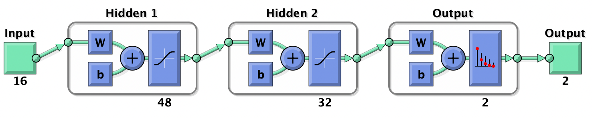
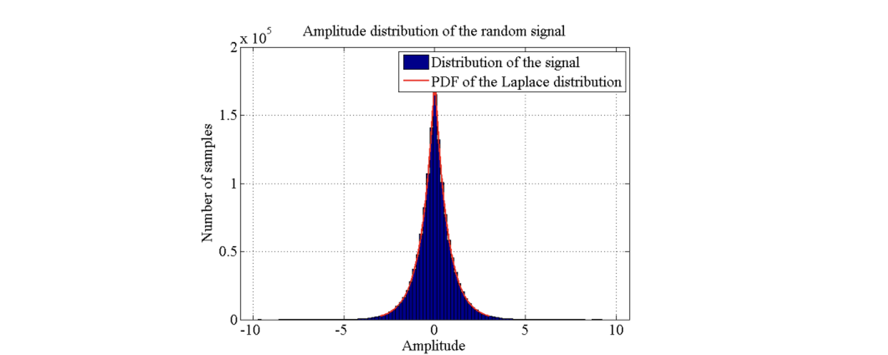

# Data anonymization   for Machine Learning
Impacts of data anonymization  on model prediction for diabetes. A feed-forward neural network is trained on the anonymized  data and the accuracy is compared. 
### Feed-forward neural network

### Diferential Privacy
Two techniques are applied for  anonymization: Laplace noise and generalization herarchies.

### Dataset
The [dataset](https://archive.ics.uci.edu/ml/datasets/Early+stage+diabetes+risk+prediction+dataset.) contains 16 features and 520 records which were collected using direct questionnaires
from the patients of Sylhet Diabetes Hospital in Sylhet, Bangladeshusi.

Islam M.M.F., Ferdousi R., Rahman S., Bushra H.Y. (2020) Likelihood Prediction of Diabetes
at Early Stage Using Data Mining Techniques. In: Gupta M., Konar D., Bhattacharyya S.,
Biswas S. (eds) Computer Vision and Machine Intelligence in Medical Image Analysis. Advances in
Intelligent Systems and Computing, vol 992. Springer, Singapore.
https://doi.org/10.1007/978-981-13-8798-2_12
### Report
The report is under review and will be available soon.
